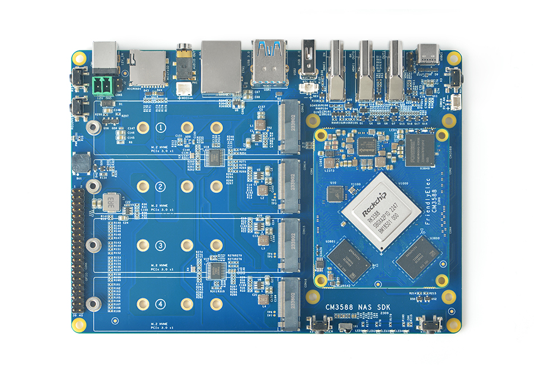
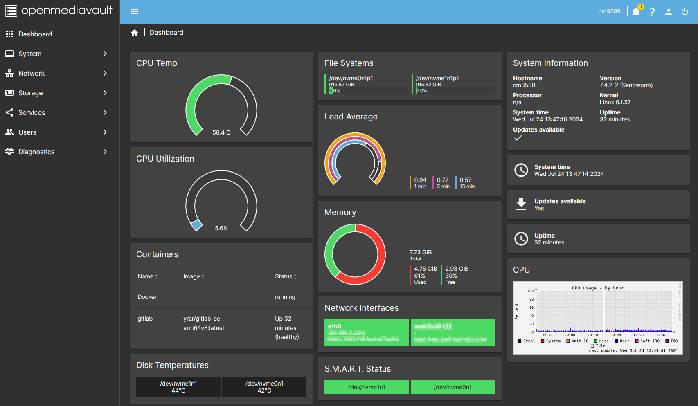

<a name="readme-top"></a>

<br />
<div align="center">
  <a href="https://github.com/Ponti17/CM3588">
    
  </a>

<h3 align="center">FriendlyElec CM3588</h3>
  <p align="center">
    A headless OMV 7 install running a dockerized GitLab instance.<br/>
    Written for Linux beginners <i>by</i> a Linux beginner.
    <br />
  </p>
</div>

<details>
  <summary>Table of Contents</summary>
  <ol>
    <li>
      <a href="#about-the-cm3588">About the CM3588</a>
      <ul>
        <li><a href="#about-this-project">About This Project</a></li>
      </ul>
    </li>
    <li><a href="#sources-of-information-and-wikis">Sources of Information and Wikis</a></li>
    <li><a href="#installing-an-os">Installing an OS</a></li>
    <li><a href="#configuring-debian-bookworm">Configuring Debian Bookworm</a></li>
    <li><a href="#installing-openmediavault">Installing OpenMediaVault</a></li>
    <li><a href="#installing-tailscale">Installing Tailscale</a></li>
    <li>
      <a href="#installing-docker">Installing Docker</a>
      <ul>
        <li><a href="#configuring-docker">Configuring Docker</a></li>
      </ul>
    </li>
    <li>
      <a href="#installing-gitlab">Installing GitLab</a>
      <ul>
        <li><a href="#using-gitlab-cli-(glab)">Using GitLab CLI (glab)</a></li>
      </ul>
      <ul>
        <li><a href="#reducing-gitlab-ram-usage">Reducing GitLab RAM Usage</a></li>
      </ul>
    </li>
  </ol>
</details>

## About the CM3588

The [FriendlyElec CM3588](https://www.friendlyelec.com/index.php?route=product/product&product_id=294) is a _high performance computing module_ featuring the RK3588 ARM based chip. All of the interesting specs are listed on the [main site](https://www.friendlyelec.com/index.php?route=product/product&product_id=294), a [brief datasheet](https://www.rock-chips.com/uploads/pdf/2022.8.26/192/RK3588%20Brief%20Datasheet.pdf) for the Rockchip RK3588 can also be found listing all capabilities of the chip.

The RK3588 is a powerful and efficient 8-core ARM processor. The carrier board sold with the CM3588 features a good selection of connectivity and **4 M.2 drive slots**, making it _very_ attractive for a NAS build.

Typical power consumption seems to be in the range of 7-15W depending on load. The CPU usually sits at 55-60C in a closed box with _no_ active ventilation.

I used this [very nice case by Fuzzler](https://www.printables.com/model/857903-friendlyelec-cm3588-nas-case-desktop-standalone).

### About This Project

I bought the CM3588 with a very specific purpose in mind. I needed a NAS for having a shared folder in windows that i could access from all of my machines (and from anywhere).

I was also interested in hosting my own GitLab instance, for storing and managing projects. To accomplish this i will be using:

- OpenMediaVault
- Tailscale
- Docker
- GitLab CE

## Sources of Information and Wikis

The [FriendlyElec Wiki](https://wiki.friendlyelec.com/wiki/index.php/CM3588) is really good and great source of information, but it can, however, be a bit overwhelming.

The [omv-extras Wiki](https://wiki.omv-extras.org/) also offers good instructions for setting up Docker in OMV.

[This guide](https://github.com/DukeChocula/CM3588) by DukeChocula is also quite nice and even details installation of ZFS if that is relevant for you. A lot of the initial OS install of this guide is based on the one by DukeChocula.

## Installing an OS

I bought the 8GB RAM/64GB eMMc model and will flash the OS to the eMMC over USB. The only requirement is a USB-C cable. The install is headless, meaning that we won't connect a monitor or any peripherals to the CM3588.

1. Download `DriverAssitant_v5.12.zip` under _tools_ in the official [FriendlyElec Drive](https://drive.google.com/drive/folders/1FoBbP_nPkMehwBj4wHwsbRU-QGjEdeEP). Unzip and install the drivers on the machine flashing the CM3588.
2. Download `rk3588-usb-debian-bookworm-core-6.1-arm64` under _tools_ > _03\_USB upgrade images_.
3. Unzip files in a known location.
4. Press and hold the "Mask" key, power on the CM3588. After the status LED has been on for at least 3 seconds, release the "Mask" key and connect a USB cable from the CM3588 to your computer (use the USB-C port on the CM3588).
5. Go the the directory where you extracted `rk3588-usb-debian-bookworm-core-6.1-arm64` and start `RKDevTool.exe`. You should see "Found a new Maskrom device" message. Click "run". The tool should now install the OS to the CM3588's eMMC.
6. After a successful install the CM3588 should automatically reboot.

## Configuring Debian Bookworm

The OS we just installed is Debian 12, also known as Bookworm. Since we are doing a headless install we will login to the CM3588 over the local network using SSH.

1. Connect the CM3588 to the local network using a Ethernet cable.
2. Login to your router (typically an address like 192.168.1.1).
3. Set a static IP for the CM3588 so it won't get reconfigured randomly by DHCP.
4. Install PuTTy and SSH into the CM3588 using the new static IP for the CM3588.
5. If everything is working you should be prompted to login.

By default there are 2 accounts.

<blockquote>
Username: root <br />
Password: fa
</blockquote>

<blockquote>
Username: pi <br />
Password: pi
</blockquote>

### Changing Root Password

The first and most important thing we will do is change the root password. This is really important as the root user has complete system access. Later we will even make it _impossible_ to login to the root user over SSH. This is another important security step as the root user always has username _root_.

Login to root using the default password `fa`. Change password using

```bash
passwd
```

### Configure User

While logged in as root we will delete the default user.

```bash
deluser pi
```

We will now create our own user. You are free to choose a fun name, but i felt particularly inspirationless that day and choose the username `nas`.

```bash
useradd nas
```

The newly added user is going to be the primary user we will use when logging in to the CM3588. Set a password and add it to the sudoers group.

```bash
passwd nas
```

```bash
usermod -aG sudo nas
```

From now on we will use the nas user instead of root.

## Installing OpenMediaVault

We now have a squeaky clean and fresh Debian install and are ready to install OMV. We will use the official install script ([see more here](https://github.com/OpenMediaVault-Plugin-Developers/installScript)).

```bash
sudo wget -O - https://github.com/OpenMediaVault-Plugin-Developers/installScript/raw/master/install | sudo bash
```

This automatically installs OMV.

It will take some time. When it is done the SSH session will be disconnected.

You should be able to access OMV using the local IP address for the CM3588. Login using the default admin user.

<blockquote>
Username: admin <br />
Password: openmediavault
</blockquote>

Make sure to change the admin password. You should see the _beautiful_ (but probably empty) OMV dashboard.

<div align="center">
  <a href="https://github.com/Ponti17/CM3588">
    
  </a>
</div>

### Disable root SSH login

We will now disable root login via SSH. We do this step now since OMV would otherwise overwrite this change after install. SSH back into the system.

```bash
vim /etc/ssh/sshd_config
```

Search for `PermitRootLogin yes` and change it to `PermitRootLogin no`.

```bash
systemctl restart ssh
```

## Configuring OpenMediaVault

The [FriendlyElec Wiki](https://wiki.friendlyelec.com/wiki/index.php/Getting_Started_with_OpenMediaVault) is absolutely excellent for describing the OMV setup process. It fully details drive and user setup as well as setting up a SMB share.

## Installing Tailscale

Tailscale can be installed at the system level very easily by

```bash
curl -fsSL https://tailscale.com/install.sh | sh
```

Follow the install script to finalize setup.

The CM3588 should now be added to your Tailnet, allowing access to it and the network share from all Tailscale devices (and with a secure connection).

### Setting up Tailscale DNS

Login to Tailscale and go to _Admin Console_ > _DNS_.

Rename your Tailnet or just use the default if you want. In either case note it down. Using Tailscale we can access the CM3588 by typing the tailscale device name (i simply named mine cm3588) followed by the Tailnet address i.e. cm3588.your-tailnet.ts.net.

Make sure MagicDNS is enabled. Also enable HTTPS certificates. A Tailscale connection should always be secure, but we must enable HTTPS for GitLab since many tools will otherwise refuse to work with it (believing it is nonsecure).

## Installing Docker

1. Under _System_ > _omv-extras_ enable "Docker repo" and save.
2. Under _System_ > _Plugins_ find a highlight `openmediavault-compose` and click install.

### Configuring Docker

We need to specify some folders where docker related data is stored. The [omv-extras Wiki](https://wiki.omv-extras.org/doku.php?id=omv7:docker_in_omv#install_and_configure_docker) (2. Plugin Settings) details this excellently.

Most importantly is the `appdata` folder, as this is where persistent data is stored.

We can create a global environment variable for the appdata folder path. Go to _Services_ > _Compose_ > _Files_ and click on "Edit global environment file". Add the following line

```global-environment-file
PATH_TO_APPDATA=<path-to-your-appdata>
```

Docker is now ready.

## Installing GitLab

We will be using GitLab CE. At the moment there is no official support for running GitLab in Docker for ARM64. There is however a [unofficial docker image](https://hub.docker.com/r/yrzr/gitlab-ce-arm64v8) that works well.

Getting GitLab working is easy enough using Docker compose. There is, however, a little challenge in getting it to work nicely with Tailscale and glab (GitLab CLI).

Under _Services_ > _Compose_ > _Files_ create a new file. I used the following docker-compose file. It informs GitLab of your Tailnet name which will be used to access GitLab. Note that we are using port 8929 for accessing GitLab (just cm3588.your-tailnet.ts.net accesses OMV).

```docker-compose
services:
  gitlab:
    image: yrzr/gitlab-ce-arm64v8:latest
    container_name: gitlab
    restart: always
    hostname: 'your-hostname'
    environment:
      GITLAB_OMNIBUS_CONFIG: |
        letsencrypt['enable'] = false
        external_url 'https://cm3588.your-tailnet.ts.net:8929'
        gitlab_rails['gitlab_shell_ssh_port'] = 2424
    ports:
      - '8929:8929'
      - '443:443'
      - '2424:22'
    volumes:
      - '${PATH_TO_APPDATA}/config:/etc/gitlab'
      - '${PATH_TO_APPDATA}/logs:/var/log/gitlab'
      - '${PATH_TO_APPDATA}/data:/var/opt/gitlab'
    shm_size: '256m'
```

Save the file and start it by clicking "Up". We are only starting the container now for GitLab to initialize the persistent files and directories. Note that it will take a while for GitLab to initialize. When it is done stop it by pressing "Down".

We must now generate HTTPS certificates using Tailscale. SSH into the CM3588 and run `tailscale cert`. When it is done you should see two files:

1. `cm3588.your-tailnet.ts.net.crt`
2. `cm3588.your-tailnet.ts.net.key`

We must now pass these to GitLab.
Move them to GitLabs `/etc/config/ssl` folder. The actual directory using the compose file above should be `/srv/dev-disk-by-uuid-UUID/config/ssl`.

Start the GitLab container again by pressing "Up". With any luck you should now be able to access GitLab with Tailscale using the address `https://cm3588.your-tailnet.ts.net:8929`.

You must now login as admin and configure GitLab to your liking, adding users etc.. GitLab autogenerates a admin password located in a file in the `appdata/config` folder. Note that this file is automatically deleted after 24 hours.

Note that the HTTPS certificates expire after 90 days. After which you must generate them again and replace the expired ones.

### Using GitLab CLI (glab)

It was very important to me that i could get glab working on all of my machines for interfacing with the CM3588 GitLab instance. glab is a command-line tool that allows quick and easy repo management. It also, importantly, allows you to script your way of of tedious repo tasks using your favorite scripting language (e.g. Python).

Login in to your GitLab user. Click on your profile icon and go to _Preferences_ > _Access Tokens_. Add a new token in the "api" and "write\_repository" scopes. Save the token.

Install glab on your device. My preferred method of installation is using a package manager

```bash
choco install glab
```

Now we must login with glab

```bash
glab auth login --hostname cm3588.your-tailnet.ts.net:8929
```

1. Login using token (the one you just saved).
2. Use HTTPS as default git protocol.
3. Authenticate Git with GitLab credentials (yes).
4. Use HTTPS as host API protocol.

You should be logged in as your GitLab user. You can use glab to create, delete and configure your repos.

### Reducing GitLab RAM Usage

By default GitLab will consume quite a lot of ram. If the GitLab server is for private use you can reduce the amount of workers without any performance loss. In `/srv/dev-disk-by-uuid-UUID/config/gitlab.rb` uncomment and adjust the following:

```
puma['worker_processes'] = 0
prometheus_monitoring['enable'] = false
postgresql['shared_buffers'] = "256MB"
```

This reduces the ram usage to just under 2GB.

## Jellyfin

The CM3588 is extremely capable at video transcoding due to the integrated GPU. Jellyfin can easily be hosted on system alongside GitLab in another Docker container.

First we must install drivers for the Mali GPU. They are hosted on GitHub [link](https://github.com/tsukumijima/libmali-rockchip). Download the latest using `wget`:

```bash
wget https://github.com/tsukumijima/libmali-rockchip/releases/download/v1.9-1-3238416/libmali-valhall-g610-g13p0-gbm_1.9-1_arm64.deb
```

Install using dpkg:

```bash
dpkg -i libmali-valhall-g610-g13p0-gbm_1.9-1_arm64.deb
```

In the Docker global environment file we add the paths to where we want to store Jellyfin cache and configuration, as well as the path to our media. I choose the media path to be a folder on the SMB share.

```
JELLYFYN_CONFIG=/srv/<path>
JELLYFIN_CACHE=/srv/<path>
PATH_TO_MEDIA=/srv/<path>
```

Next use the following Docker compose file:

```docker-compose
services:
  jellyfin:
    image: 'ghcr.io/jellyfin/jellyfin:10.9.10'
    container_name: 'jellyfin'
    ports:
      - '8096:8096/tcp'
    security_opt: true
      - systempaths=unconfined
      - apparmor=unconfined
    group_add:
      - 44 # video group
    devices:
      - '/dev/dri:/dev/dri'
      - '/dev/dma_heap:/dev/dma_heap'
      - '/dev/mali0:/dev/mali0'
      - '/dev/rga:/dev/rga'
      - '/dev/mpp_service:/dev/mpp_service'
    volumes:
      - '${JELLYFIN_CONFIG}:/config'
      - '${JELLYFIN_CACHE}:/cache'
      - '${PATH_TO_MEDIA}:/media'
    restart: unless-stopped
```

Now start the container. Jellyfin should be available on port 8096. When Jellyfin is set up remember to enable hardware transcoding.


<p align="right">(<a href="#readme-top">back to top</a>)</p>
